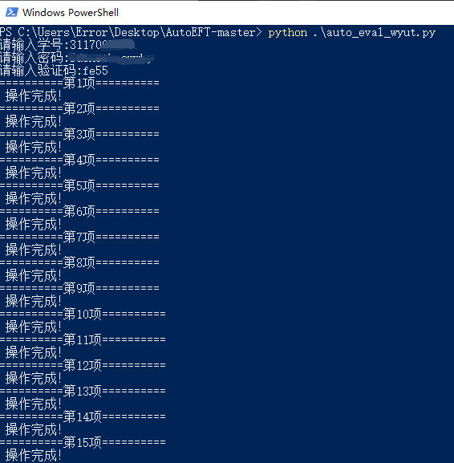
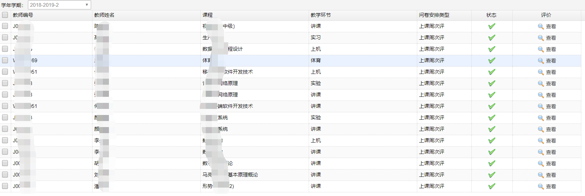
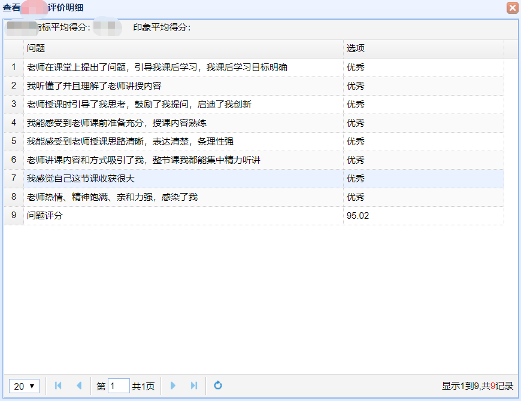

一键自动完成教师评价
------
*模拟登陆学生管理系统，并自动对相应学生的所有教师进行评价。*  
*author: Afeng*  
*date: 2019/06/13*

环境说明
* 系统环境  
支持Windows、Linux
* 运行环境  
python3.x  

教师评价系统中，根据不同老师授予的课程教学环节不同，评价内容不同。  

当前已适应评价的教学环节包括
- [x] 讲课
- [x] 实习
- [x] 体育
- [x] 上机
- [x] 实验
- [ ] 未知 

当前对教师评价等级包括
- [x] 优秀（95.02）
- [x] 良好（85.02）
- [x] 中等（75.02）
- [ ] 及格
- [ ] 不及格


 Run
---
安装脚本依赖环境包
```
    pip install -r requirements.txt
```

在相应文件目录下打开终端、输入指令
* Windows
```
    python ./auto_eval_wyut.py
```

* Linux
```
    python auto_eval_wyut.py
```

修改评价等级
* 若直接运行，则评价等级为"A"，即优秀，总评分95.02
* 可修改评价等级，当前包括三个评价等级: A B C，即优秀、良好、中等  
操作如下(直接修改auto_eval_wyut.py文件中的level变量值)
~~~python
    level = "X"
~~~


效果
---
使用说明  
* 以Windows 10下PowerShell终端使用进行说明  
* 依照提示输入学号、密码
* 查看验证码后关闭，将验证码输入终端中
* 完成操作，等待脚本自动进行教师评价  


效果说明  
* 脚本按照程序预设进行教师评价，点击查看与正常提交操作无异！
* 对老师默认评价为优秀（总分95.02）、意见为空



The detail code is private!
Contact with me if u want.
